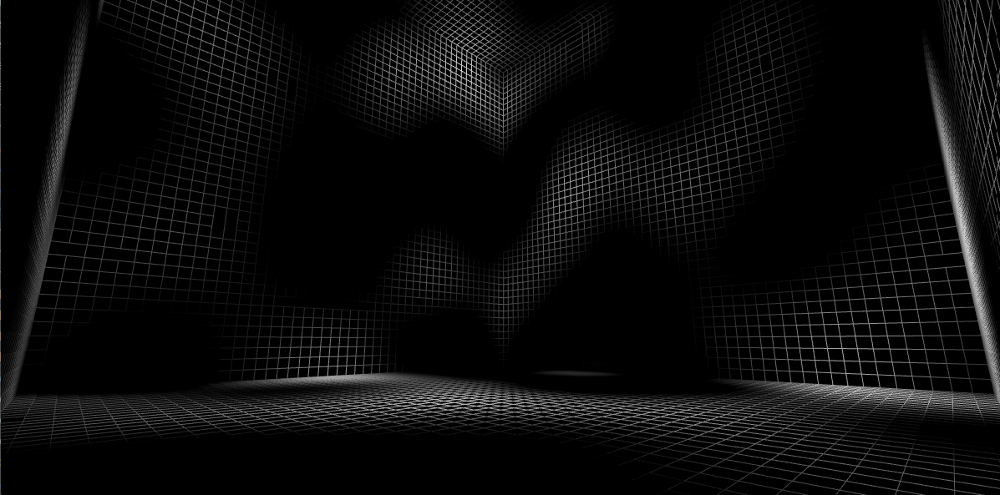

# Voxel Engine
Voxel Engine programmed in C++ visualized using OpenGL. The engine utilizes greedy meshing as a method of optimization, when using an OpenGL vertex shader.

## Noise Generation
The voxel engine uses a simple 3D perlin noise generation algorithm based on the approach in motuDev's video https://www.youtube.com/watch?v=SoakEoUQ7Rg&ab_channel=motuDev availible on youtube.

### Examples
#### Simple 3D Noise - Frequency: 0.06
[]

#### Simple 3D Noise - Frequency: 0.06
[]

#### Simple 3D Noise - Frequency: 0.10
[]

#### Simple 3D Noise - Frequency: 0.02
[]

## Mesh Optimization
All these mesh optimizations are done on the GPU however there is overhead when transfering information from the CPU to the GPU which is the biggest bottleneck.
### Voxel Face Culling
All voxels utilize a GPU shader to determine whether their neighbouring voxel is empty and if they will render those neighbouring faces. All voxel chunks check their neighbouring chunks voxels to determine whether the exterior voxels should be rendered. 

#### Examples
##### Voxel Face Culling - Default
[]

##### Voxel Face Culling - All Solid Voxels - Exterior Wiremesh
[]

##### Voxel Face Culling - All Solid Voxels - Interior Wiremesh
[]

##### Voxel Face Culling - Default - Wiremesh
[]

### Greedy Meshing
The voxel engine utilizes GPU based greedy meshing such that all neighbouring faces of voxels with the same voxel type (noise value) will combine their faces to reduce vertices.

#### Examples
##### Greedy Meshing - Default
[]

##### Greedy Meshing - All Solid Voxels
[]

##### Greedy Meshing - Default - 5 Voxel Types
[]

##### Voxel Face Culling - All Solid - 1 Voxel Type
[]

## Voxel Engine Examples
**_NOTE:_** Previews below may take time to load.
**_NOTE:_** All previews are gifs recorded at 15fps and do not reflect engine performance.

### Default 3x3x3 - Walkthrough
[]

### Default 12x12x12 - Walkthrough
[]

# Optimization History
|Date|Optimization|Methods|Chunk Size (Voxels)|World Size (Chunks)|Total Voxels|FPS|Memory|
|:---:|:---:|:---:|:---:|:---:|:---:|:---:|:---:|
|06/04/2023|Pre-Scene Rendering Optimizations|All Faces Rendered|16x16x16|12x12x12|7,077,888|~60fps|Not Documented|
|06/04/2023|Pre-Scene Rendering Optimizations|Greedy Meshing|16x16x16|12x12x12|7,077,888|~100fps|Not Documented|
|06/04/2023|Pre-Scene Rendering Optimizations|Greedy Meshing|16x16x16|12x12x12|7,077,888|~120fps|Not Documented|
|06/04/2023|Pre-Scene Rendering Optimizations|Greedy Meshing and Perlin Noise|16x16x16|12x12x12|7,077,888|~4fps|Not Documented|
|06/04/2023|Post-Scene Rendering Optimizations|Greedy Meshing and Perlin Noise|16x16x16|12x12x12|7,077,888|~25fps|~30gb|
|07/04/2023|Post-Scene Rendering Optimizations, Fixed Buffer Memory Leak|Greedy Meshing and Perlin Noise|16x16x16|12x12x12|7,077,888|~25fps|~8gb|
|07/04/2023|Chunk Byte Size Reduction|Greedy Meshing and Perlin Noise|16x16x16|12x12x12|7,077,888|~30fps|~1.5GB|
